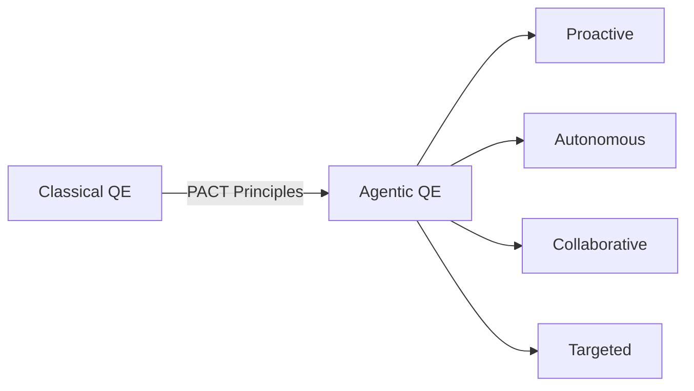

# Hi, I'm Dragan Spiridonov 👋

**Agentic Quality Engineer | Bridging Classical QE to the Future**

Currently building [Quantum Quality Engineering](https://quantum-qe.dev) and founding the **Serbian Agentic Foundation Chapter** - Serbia's first community for agentic engineering practices.

[My portfolio](https://spiridonovdragan.com)

## 🚀 What I'm Building

### The Evolution: Classical → Agentic QE
29 years in IT - Started in 1996 doing computer repair and sysadmin, spent the last 12 years establishing and leading QA/QE functions. Built Alchemy's QA/QE organization from scratch over 8 years. 
I'm now focused on the practical evolution from traditional testing to agent-orchestrated quality systems. Not replacement - evolution.



## 🛠️ Current Focus

- **⚡ Quality Forge** - Open-source initiative bridging classical to agentic QE with production-tested tools and PACT principles
- **🏗️ Quantum QE Consulting** - Helping teams transform their quality practices through context-driven, PACT-based approaches
- **🇷🇸 Serbian Agentic Foundation** - Building Serbia's first Agentic QE community with StartIt centers
- **🤖 AQE Fleet** - Production-ready distributed AI testing framework with 16 specialized agents for comprehensive quality automation
- **📚 Agentic QE Framework** - Open-sourcing battle-tested patterns for agent-orchestrated testing
- **🦀 Sentinel** - Multi-agent testing orchestration system (Rust/Python)

## 💡 Core Philosophy

> "Quality must be built in, not tested in. Best practices are contextual, not universal."

I practice what I call the **Holistic Testing Model** - quality across all dimensions:
- **Testing in Production** - Reality is the ultimate test environment
- **Shift-Left AND Shift-Right** - Quality everywhere, not just in the testing phase
- **Risk-Based Coverage** - Test where it matters most
- **Whole Team Quality** - Everyone owns quality, agents augment but don't replace

## 🔧 Tech Stack

### Classical Foundation (Still Essential)
- **TDD** - Both London School (mockist) & Chicago School (classicist)
- **XP Practices** - Pair/ensemble programming, continuous integration
- **Exploratory Testing** - Session-based test management, heuristic approaches
- **Automation** - Robot Framework, Playwright, JMeter

### Agentic Evolution
- **Multi-Agent Systems** - Rust for performance, Python for flexibility
- **LLM Integration** - Prompt engineering for test generation
- **Explainable AI** - Every agent decision has a traceable reason
- **PACT Framework** - Proactive, Autonomous, Collaborative, Targeted agents

## 📊 Real Impact, Not Hype

```
Classical QE Achievements:
├── 60% faster test generation with AI assistance
├── 85% reduction in test maintenance through smart automation
└── 4x improvement in defect detection with exploratory agents

Agentic QE Goals:
├── 10x improvement in test effectiveness (not just speed)
├── Self-healing test suites that evolve with the product
└── Autonomous quality orchestration with human oversight
```

## 🌍 Community & Speaking

- **🎯 Founding** - Serbian Agentic Foundation Chapter (Oct 2025)
- **🎤 Speaking** - International testing conferences since 2016
- **📝 Writing** - Bridging classical to agentic QE practices
- **🏆 Former** - Belgrade Test Conference Program Chair (2017-2019)
- **🤝 Member** - Global Agentics Foundation

## 🎯 Current Projects

| Project | Description | Status | Stack |
|---------|-------------|--------|-------|
| **[Quality Forge](https://forge-quality.dev)** | Umbrella initiative for open-source agentic QE tools and methodologies | 🚀 Active | TypeScript, Rust, Python |
| **[AQE Fleet](https://github.com/proffesor-for-testing/agentic-qe)** | Distributed AI-powered testing framework with 16 specialized agents | 🚀 Active | TypeScript, Node.js |
| **[Sentinel](https://github.com/proffesor-for-testing/sentinel-api-testing)** | Multi-agent test orchestration framework | 🚧 Alpha | Rust, Python |
| **[Agentic QE Playbook](https://agentic-qe.dev)** | Open framework for PACT-based testing | 📖 v0.2 | Markdown, YAML |
| **Serbian Foundation** | Community building & meetups | 🚀 Active | IRL + Virtual |
| **[Quantum QE](https://quantum-qe.dev)** | Boutique consultancy for agentic transformation | ✅ Live | Context-driven |

## 💬 Let's Talk About

- 🤖 **Practical Agentic QE** - Real implementations, not vendor promises
- 🔄 **Classical to Agentic bridges** - Evolution paths that actually work
- 🏗️ **Context-driven quality** - Why best practices depend on your situation
- 🇷🇸 **Balkan tech scene** - Building communities in emerging markets
- 📖 **Learning & meta-learning** - How humans and agents learn together

## 📫 Connect With Me

[](https://www.linkedin.com/in/dragan-spiridonov)
[](mailto:dragan@quantum-qe.dev)
[](https://quantum-qe.dev)

## 🎲 Fun Facts

- 📚 SF/Fantasy enthusiast - Agent systems are like "fellowship of specialized beings"
- 🎭 Quality orchestration = "conducting the testing orchestra"
- 🎮 Former Test'RS Club co-founder - Serbia's first testing community
- 🌉 Bridge builder - Connecting 20+ years of classical QE with agentic future

---

### 🔮 The Future of Quality

> "We're not replacing testers with AI. We're evolving from testing-as-activity to agents-as-orchestrators. The future of quality is autonomous but explainable, proactive but controlled, collaborative but targeted. That's PACT."

---

⚡ **Currently available for**: Agentic QE transformation consulting | Speaking engagements | Community partnerships


## 📈 GitHub Stats


