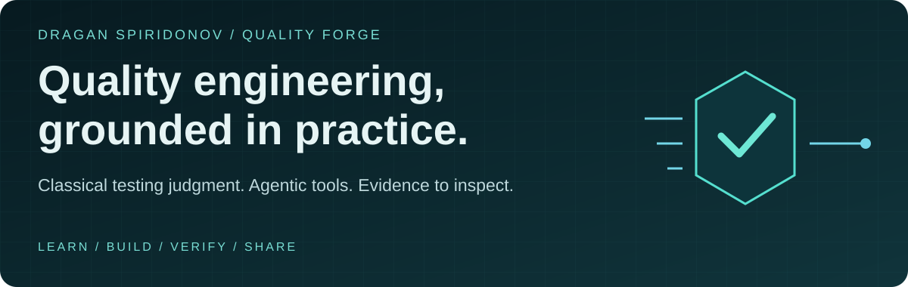
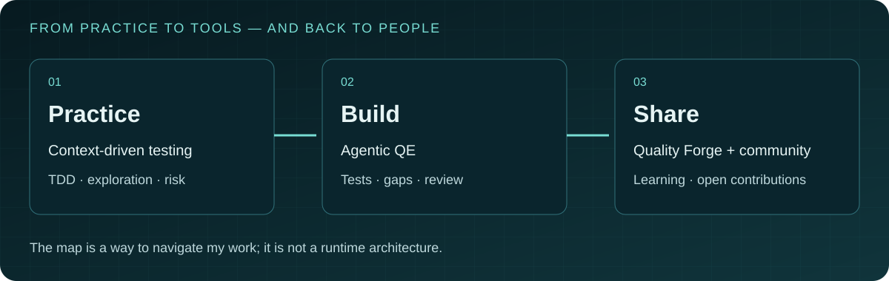
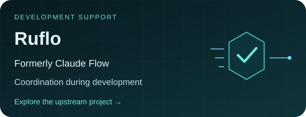
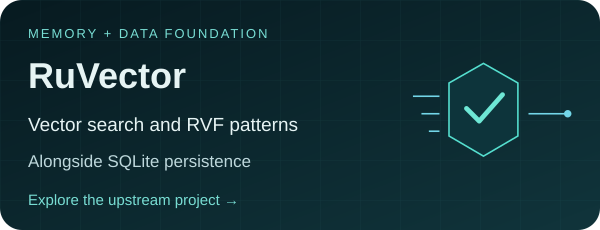

# Dragan Spiridonov

I build quality engineering tools, teach testing, and share what I learn. My work connects context-driven testing, exploratory practice and TDD with agents that help teams investigate risk and produce useful evidence.

**Head of Agentic Quality Engineering at [Cognitum One](https://cognitum.one/).** Working in IT since 1996 and building QA/QE functions since 2014. I care about the judgment behind a test as much as the automation that runs it.

[Try Agentic QE](https://github.com/proffesor-for-testing/agentic-qe) · [Quality Forge](https://forge-quality.dev) · [Portfolio](https://spiridonovdragan.com/) · [Connect on LinkedIn](https://www.linkedin.com/in/dragan-spiridonov)

## Find a useful starting point

| What you want to do | Start here |
| --- | --- |
| Generate tests, investigate coverage gaps or examine a quality decision | [Agentic QE](https://github.com/proffesor-for-testing/agentic-qe) — tools for your coding agent, with setup and an evidence trail |
| Understand the principles and tradeoffs | [Quality Forge](https://forge-quality.dev) and the [Agentic QE Playbook](https://agentic-qe.dev) |
| Explore quality memory and learning | [nagual-qe](https://github.com/proffesor-for-testing/nagual-qe) |
| Explore Python orchestration or API testing | [LionAGI QE Fleet](https://github.com/proffesor-for-testing/lionagi-qe-fleet) · [Sentinel](https://github.com/proffesor-for-testing/sentinel-api-testing) |
| Learn with other practitioners | [Agentic Foundation Serbia](https://www.youtube.com/@AgenticFoundationSerbia) |
| Discuss your team's quality context | [Quantum QE](https://quantum-qe.dev) · [LinkedIn](https://www.linkedin.com/in/dragan-spiridonov) |

## How I approach quality

Quality is a whole-team responsibility. Testing helps us discover what we do not yet understand about the product, its risks and the people using it. Agents can extend that work; the team still owns the decisions.

I bring exploratory testing, London and Chicago TDD, XP practices, and risk-based coverage into this work. PACTS — **Proactive, Autonomous, Collaborative, Targeted, Structured** — gives me a way to discuss agent behavior without losing the context that makes a test useful.

When a tool generates tests, I want to know what they exercise, whether their assertions can catch a defect, and what we should investigate next. You can inspect that approach in [AQE's quality gates](https://github.com/proffesor-for-testing/agentic-qe/blob/main/docs/loki-mode-features.md) and [skill validation guide](https://github.com/proffesor-for-testing/agentic-qe/blob/main/docs/guides/skill-validation.md). The [interaction benchmark](https://github.com/proffesor-for-testing/agentic-qe/blob/main/benchmarks/interaction/results/README.md) also records a small experiment with no demonstrated benefit. Evidence includes limits and corrections.

## Learning and community

I speak at testing conferences, write about the move from classical to agentic QE, and help build the Serbian Agentics Foundation Chapter. My earlier work includes growing Alchemy's QA/QE organization and serving as Belgrade Test Conference Program Chair (2017–2019).

**Keep learning. Keep sharing.** If you have a testing problem, a reproducible failure or a question that challenges an assumption, I would like to hear it.

## Contribute and connect

Start with [AQE's contribution guide](https://github.com/proffesor-for-testing/agentic-qe/blob/main/CONTRIBUTING.md). A small reproduction, a better example, a missing test or a clearer explanation all help. Discuss a use case in [AQE Issues](https://github.com/proffesor-for-testing/agentic-qe/issues), or connect through [LinkedIn](https://www.linkedin.com/in/dragan-spiridonov) and [my portfolio](https://spiridonovdragan.com/).

## Acknowledgments

Agentic QE was developed with help from **Ruflo, formerly Claude Flow**, by [rUv](https://github.com/ruvnet). **RuVector provides the vector and RVF database foundation**, alongside AQE's SQLite persistence. I am grateful to the upstream maintainers and [AQE contributors](https://github.com/proffesor-for-testing/agentic-qe/blob/main/CONTRIBUTORS.md) whose work makes this possible.

