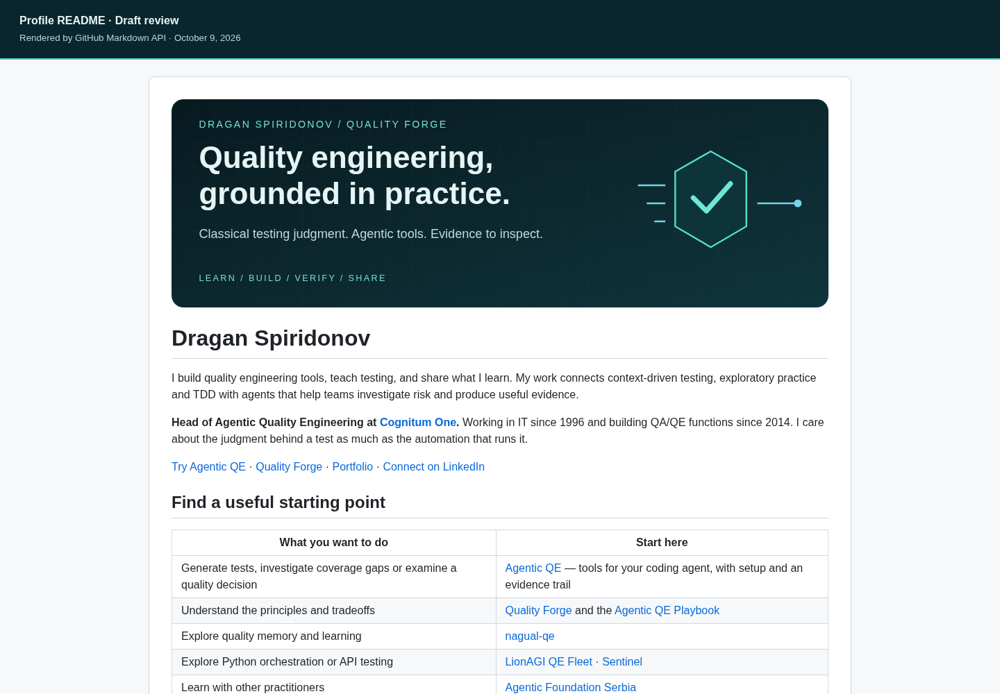

# README redesign review — October 9, 2026

Drafts for Dragan Spiridonov's GitHub profile and Agentic QE. Prepared on isolated feature branches for review; no merge, release, deployment, credential or infrastructure changes.

## Design rationale

Lead with the quality question a practitioner brings: which tests matter, what risk remains, and what evidence can be inspected. The profile presents practice → tools → shared learning, with problem-based entry points. The project presents installation → one bounded task → independent checks → a quality decision → contribution. Classical QE judgment remains visible throughout.

Original dark teal/cyan SVG artwork uses a verification gate motif. A static conceptual loop explains the workflow without presenting a mock UI as a live product. Images have meaningful alt text, system fonts, fixed viewBoxes, and no scripts, external resources, embedded HTML or animation dependencies. Important content also appears in ordinary Markdown. Credits use original clickable cards, readable as stacked cards on mobile, and separate development support from runtime dependencies.

Inspired by rUv's layered navigation, visual entry points and evidence scoping. No reference graphics, slogans, logos, counts or branding were copied. No reach metrics, speed claims, toy output numbers, universal learning claims or old skill-tier totals were retained. Existing install commands, client flags, Windows caveats, provider setup, license and contributor recognition were retained or clarified. The old Discussions link was removed because GitHub confirms `has_discussions: false` and its endpoint returns 404. Monetary sponsorship details remain in FUNDING.md rather than duplicated in the README.

## Verified source snapshot

- AQE main and local HEAD before editing: `829d03060d56ee82e6fa294b2be8f6c5fc9f2766`, October 4, 2026. Public main checked via GitHub API on October 9. README inventory is explicitly pinned to this source snapshot.
- `package.json` and npm registry `agentic-qe/latest`: **3.14.8**, Node **≥22.13.0**, npm **≥10.0.0**. MIT agrees with LICENSE. These are observed versions, not frozen installation requirements beyond the documented engines.
- `assets/agents/v3/qe-*.md`: **53**; `assets/agents/v3/subagents/qe-*.md`: **7**. Total **60** shipped QE definition files. Non-QE/platform definitions and README indexes are excluded; the existing generated agent index claims zero, so it was not used as inventory evidence.
- `assets/skills/*/SKILL.md`: **86** packaged entry points. Supporting Markdown is excluded. No inferred trust-tier totals; asset presence is not effectiveness evidence.
- `src/domains/`: **13** immediate domain directories.
- Plugin: `plugins/agentic-qe-fleet/agents/*.md` **11**, `skills/*/SKILL.md` **9**, `commands/*.md` **9**.
- Client setup: default Claude Code plus ten named `--with-*` client flags in `src/cli/handlers/init-handler.ts`, corroborated by `src/init/platform-config-generator.ts` and platform docs. Configuration support is distinct from equal tested capability in all clients.
- `package.json` declares `@ruvector/attention`, `gnn`, `learning-wasm`, `router`, `rvf-node`, `sona` and `better-sqlite3`. `src/integrations/ruvector/shared-rvf-adapter.ts` uses `.agentic-qe/patterns.rvf` and includes SQLite degradation paths. Credit accurately identifies RuVector's vector/RVF database foundation alongside SQLite; it does not claim all persistence is RuVector.
- Ruflo README explicitly says Claude Flow is now Ruflo. User confirmed development attribution. Repository AGENTS.md forbids adding Ruflo as a runtime dependency; draft explicitly distinguishes its development role.
- `benchmarks/interaction/results/README.md`: June 11, 2026 run, two scenarios, underpowered and no demonstrated benefit. Retained as a scoped evidence example; this redesign did not rerun it or imply a new passing benchmark.

## Source inventory

### Product and contribution sources

- [Current AQE repository](https://github.com/proffesor-for-testing/agentic-qe), its README, package.json, LICENSE, AGENTS.md, CONTRIBUTING.md, SECURITY.md, CONTRIBUTORS.md and FUNDING.md.
- [Source snapshot](https://github.com/proffesor-for-testing/agentic-qe/tree/829d03060d56ee82e6fa294b2be8f6c5fc9f2766).
- [npm package](https://www.npmjs.com/package/agentic-qe) and registry metadata.
- Shipped QE files, plugin definitions, CLI handler, platform generator, RuVector adapters, skill validation guide, Loki-mode guide, QE Court ADR, MCP tests and benchmark run records.
- [Confirmed profile repository](https://github.com/proffesor-for-testing/proffesor-for-testing), default branch `main`. Cloned separately; original profile content read before editing; no repository AGENTS.md present.

### Public presentation references inspected

- [rUv profile](https://github.com/ruvnet): read actual README; browser screenshot inspected. Navigation, ecosystem map and scoped metrics informed structure only.
- [Ruflo](https://github.com/ruvnet/ruflo): README and actual browser screenshot inspected; native upstream `docs/assets/readme/ruvector-promo-depth.svg` rendered and inspected. Its clickable visual card concept informed original credit cards.
- [RuVector](https://github.com/ruvnet/ruvector): README and actual browser screenshot inspected; header/trailer SVG inspected as source. Learning caveats informed careful feedback wording; no runtime integration is inferred from reference art.
- [Dragan's portfolio](https://spiridonovdragan.com/) and [Quality Forge](https://forge-quality.dev/) corroborate public identity and existing project links.

### Writing references

- [When the Pipeline Became the Bottleneck](https://forge-quality.dev/articles/when-the-pipeline-became-the-bottleneck), September 30, 2026: read bylined article for current practitioner voice and accountability.
- [The Court That Blocked My Release](https://forge-quality.dev/articles/court-that-blocked-my-release), July 19, 2026: read bylined article for verification reasoning and human judgment.
- Existing profile README: author-maintained reference for priorities and biographical details; unscoped improvement percentages were omitted.
- Read applicable `forge-quality-voice` and writing-style skills. The Forge skill's linked reference resources could not be opened through the skill reader; current public bylined writing supplied the needed voice evidence. Read repository AGENTS.md. User's explicit draft-PR authorization superseded the original local-only preparation limit.

## Validation and review artifacts

- GitHub Markdown API (`mode=gfm`, repository contexts) rendered both exact candidate READMEs successfully. Browser preview uses this sanitized HTML and approximate GitHub CSS; it is not a claim of pixel-identical GitHub layout.
- Playwright/Chromium rendered desktop **1440 px**, mobile **390 px**, and dark previews. No page-level horizontal overflow in either document at either tested width. Tables and command blocks scroll horizontally as GitHub does. SVGs rendered separately for visual inspection.
- **35** unique local link/image targets and **8** SVG files across both repositories pass path/XML/safety checks. Actual counts are recorded in `validation.json`.
- External links were checked with HTTP HEAD or exact local source validation for GitHub blob URLs. Existing Discussions 404 was corrected. LinkedIn returns **405 for HEAD**, and the YouTube channel is blocked by this environment's network proxy (**403**); those two existing public links are retained with their actual URLs, without claiming an automated availability pass. Other checked external targets resolved successfully. Social destinations may require authentication.
- `git diff --check` run for both repositories. No runtime source, package, lockfile, license, workflows, databases, infrastructure or credentials changed. Runtime tests were not run for these documentation/asset changes.
- Local review bundle: `index.html` (both documents with light/dark toggle), separate preview HTML files, sanitized GitHub HTML, full desktop/mobile/dark PNGs, original visual PNG renderings, validation JSON and renderer/check scripts. Branch README renders are the canonical GitHub review surface.

## Serbian summary

Pripremljen je povezan teal/cyan izgled profila i Agentic QE projekta: praktična QE vrednost, jasan početak rada, proverljive tvrdnje i konkretan put za doprinos. Na dnu su zahvalnice i originalne klikabilne kartice za Ruflo, ranije Claude Flow, i RuVector. Aktuelni brojevi su provereni iz izvora, a ne preuzeti iz starog README-ja. Promene su namenjene draft PR pregledu; ništa nije spojeno ni objavljeno kao sajt.

## Rendered candidate

[Full desktop PNG](profile-desktop.png) · [Mobile PNG](profile-mobile.png) · [Dark PNG](profile-dark.png) · [Download standalone HTML preview](profile-preview.html)
